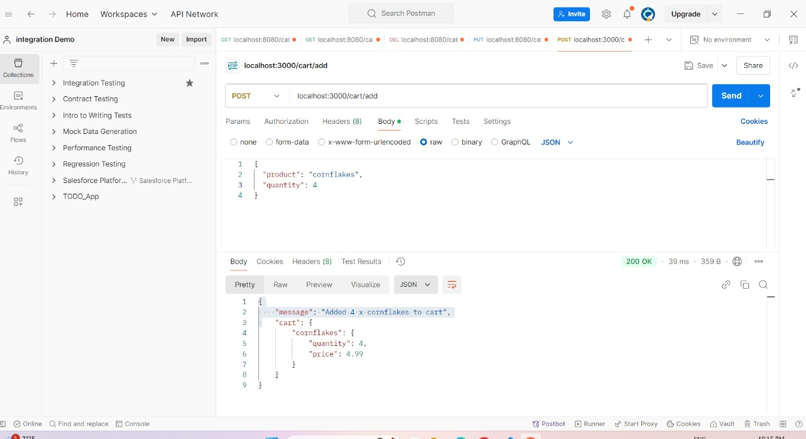
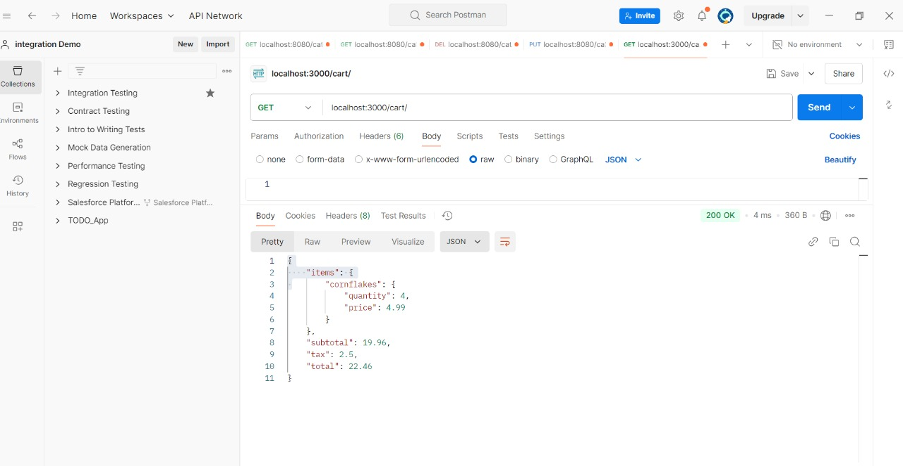

# Shopping Cart Assignment

## 📌 Overview

This project is a simple shopping cart implemented using **Node.js** and **Express.js**, integrating with a mock **Price API** to fetch product prices. It provides basic shopping cart functionality, including adding items, calculating totals, and applying tax.


## 🛠️ Setup & Installation

1. Clone this repository:
   ```sh
   git clone <repo-link>
   cd shopping-cart-assignment

2. Install Dependencies:
   ```sh
   npm install

3. Start the price API:
   ```sh
   npm run serve-products

4. Start the server:
   ```sh
   npm start

## 🧪 Testing the API

1️⃣ Add Products to Cart
#### Endpoint: POST /cart/add


2️⃣ View Cart Summary
#### Endpoint: GET /cart


## Using Postman:
1. Start the server (npm start).
2. Use Postman to send POST and GET requests to:
   - POST http://localhost:3000/cart/add
   - GET http://localhost:3000/cart
   
## 🚀 Features

- Adding products to the cart
- Retrieve product prices from the Price API.
- Calculate cart subtotal, tax (12.5%), and total payable amount
- Simple API structure following best practice.

### Assumptions:

1. Products exist in the Price API, and no validation is required on our end.
2. The shopping cart does not persist data; it resets on server restart.

### Tradeoffs:

- No database is used for storage.
- The API does not include authentication for simplicity.

